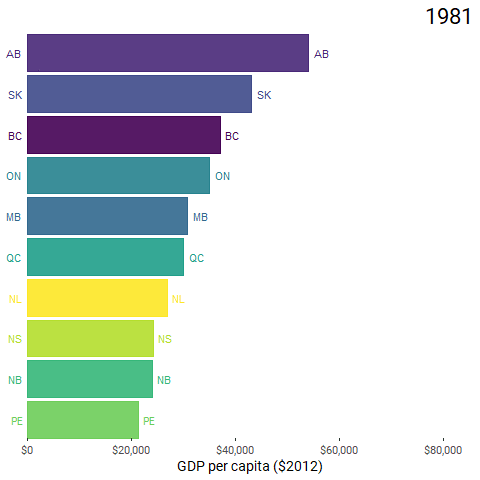
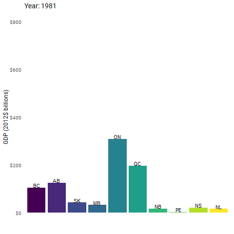
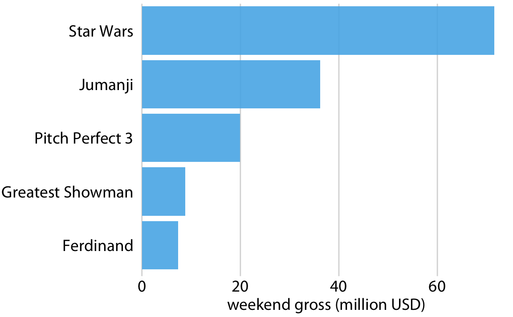
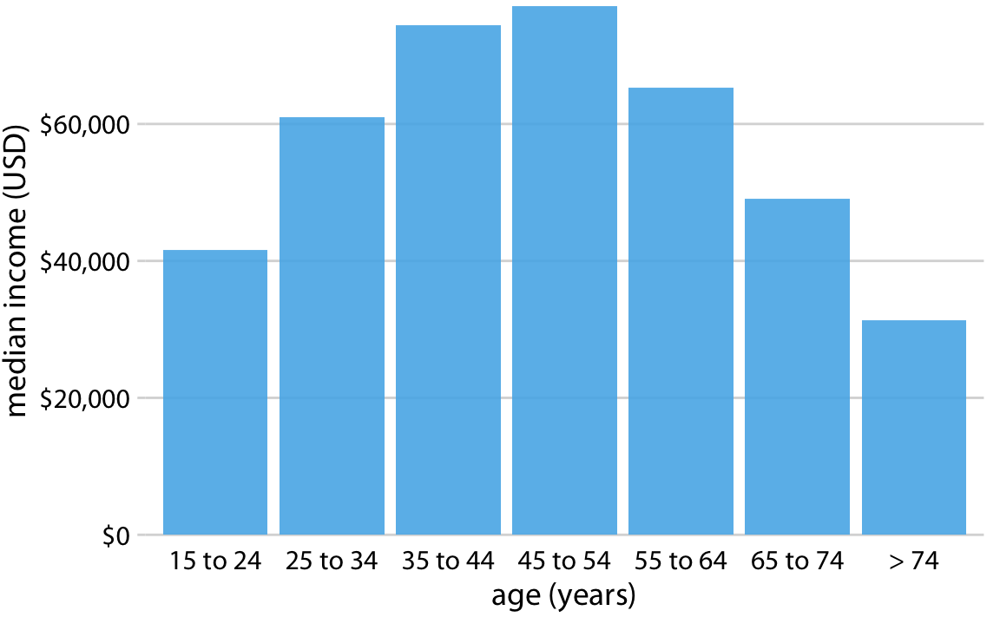
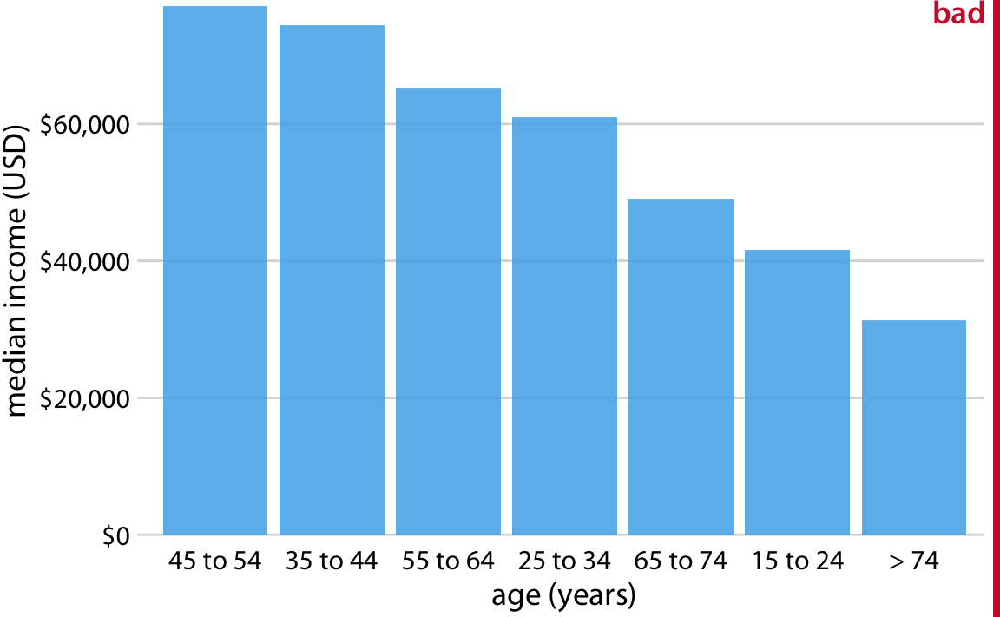
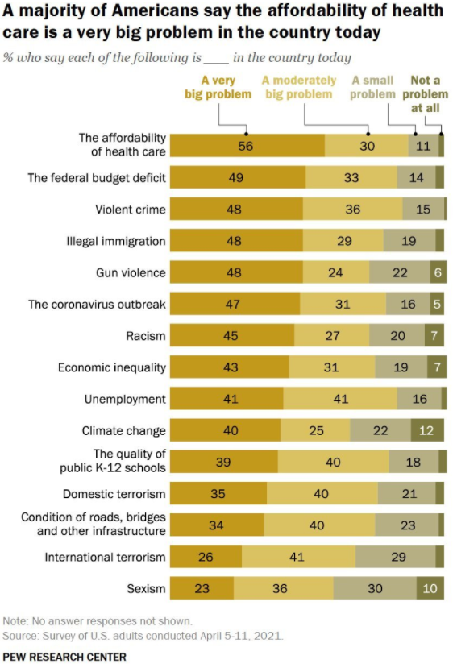
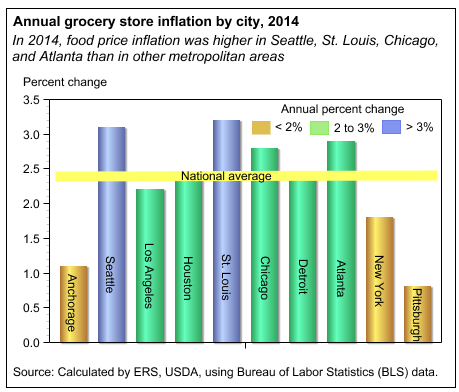

```{css, echo=FALSE}
# CSS for including pauses in printed PDF output (see bottom of lecture)
@media print {
  .has-continuation {
    display: block !important;
  }
}

.remark-slide-scaler {
    overflow-y: auto;
}
```

```{r setup, include=FALSE}
options(htmltools.dir.version = FALSE)
library(knitr)
opts_chunk$set(
  fig.align="center",  
  fig.height=4, #fig.width=6,
  # out.width="748px", #out.length="520.75px",
  dpi=300, #fig.path='Figs/',
  cache=T#, echo=F, warning=F, message=F
  )
library(tidyverse)
library(hrbrthemes)
library(fontawesome)
```


# Workshop preparation

☑ Download MFRE Data Workshop 2 Folder

☑ Open `Workshop 2.RProj` in RStudio

☑ Then go to `Code` folder and open up `data_viz.Rmd` 

---

# Overview

1. Fun + animated graphs in R
2. Visualization tips

---

# Hat tip

Most of the slides of this workshop are from Dr. Allison Horst's (UCSD) data visualization [workshop](https://docs.google.com/presentation/d/1EA_PfTiSXh8J0JH03d1pcA6luVJeN2oUGozxhZoiydQ/edit#slide=id.g605a49e43e_0_58) and Dr. Blake Shaffer's (UCalgary) [blog](https://www.blakeshaffer.ca/post/making-animated-charts-with-gganimate/)

---

# Learning Outcomes

- Use R packages to access and clean Statistics Canada data
- Create animated graphs in R
- Match data analytics outcomes or objectives to most appropriate graphs
- Identify misleading graphs and provide solutions for improvement

---
class: inverse, center, middle
name: animation

# Animated graphs

<html><div style='float:left'></div><hr color='#EB811B' size=1px width=796px></html>

---

# End goal

.center[]

---

# As usual

Load the packages we need 

```{r loadpackages}
pacman::p_load(tidyverse, lubridate, ggthemes, ggrepel, cansim, janitor, gganimate)
```

---

# Overview of steps

- Access the data from Statistics Canada using {cansim} package
- Do some data cleaning
- Create static and animated graphs

---

# {cansim} package

[Jens von Bergmann](https://twitter.com/vb_jens?ref_src=twsrc%5Egoogle%7Ctwcamp%5Eserp%7Ctwgr%5Eauthor) created an R package called [{cansim}](https://github.com/mountainMath/cansim) that connects to the Statistics Canada API and retrieves data tables. 

Today, we will work with this table: [Gross domestic product, expenditure-based, provincial, and territorial, annual (x 1,000,000), Table 36-10-0222-01](https://www150.statcan.gc.ca/t1/tbl1/en/tv.action?pid=3610022201) 

The code to get this table into R is `get_cansim(cansim_number)`, which in our case will be `get_cansim(36100222)` 

---

# {cansim} package

```{r cansim_sample, eval = F}
gdp_can_sample <- get_cansim(36100222) %>% filter(GEO == "Canada" & REF_DATE == 2019) %>%
  select(REF_DATE, VALUE, Prices, Estimates)
```

.pull-left[

]

.pull-right[

]

---

# {cansim}

Let's download this data and use the [`normalize_cansim_values()`](https://cran.r-project.org/web/packages/cansim/cansim.pdf) to "set all units to dollars instead of millions"

```{r accessgdp_show, message = F, warning = F}
gdp <- get_cansim(36100222) %>% normalize_cansim_values() 

glimpse(gdp)
```

---

# Writing a function

- Create a vector of Canadian provinces called `provlist`
- Write a function called `short_provs()` that will take in a data frame as an argument and create a new variable called `geo_short`, which is a 2 letter abbreviation of the province name for the provinces of interest 

```{r prov_function}
provlist <- c("British Columbia","Alberta","Saskatchewan","Manitoba","Ontario",
              "Quebec", "New Brunswick","Nova Scotia","Prince Edward Island",
              "Newfoundland and Labrador")

short_provs <- function(df){
  df <- df %>%
    filter(GEO %in% provlist) %>%
    mutate(geo_short = case_when(
      GEO=="British Columbia" ~ "BC",
      GEO=="Alberta" ~ "AB",
      GEO=="Saskatchewan" ~ "SK",
      GEO=="Manitoba" ~ "MB",
      GEO=="Ontario" ~ "ON",
      GEO=="Quebec" ~ "QC",
      GEO=="New Brunswick" ~ "NB",
      GEO=="Prince Edward Island" ~ "PE",
      GEO=="Nova Scotia" ~ "NS",
      GEO=="Newfoundland and Labrador" ~ "NL"
    ))
  
  df$geo_short <- factor(df$geo_short,
                         levels=c("BC","AB","SK","MB","ON",
                                  "QC","NB","PE","NS","NL"))
  
  df
}
```

---

# GDP by Province

- Create a `year` variable that stores `REF_DATE` variable as numeric
- Filter observations 
- Select relevant columns only

```{r gdp_mutate}
df_gdp <- gdp %>%
  mutate(year=as.integer(REF_DATE)) %>% 
  filter(GEO %in% provlist,
         Prices=="Chained (2012) dollars",
         Estimates=="Gross domestic product at market prices") %>%
  select(GEO, year, gdp = VALUE)
```

---

# Tidy Data

- Is the data tidy?
- Does one variable occupy one column in the data frame? 

---

# Using the function

- Create a new variable called `geo_short` using the `short_provs()` function we specified earlier
- Clean the variable names using `clean_names()` function

```{r accessgdp, message = F, warning = F}
df_gdp <- short_provs(df_gdp) %>%
  clean_names()
  
head(df_gdp)
```

---

# Let's start graphing!

```{r plotgdp, out.width = '500px', out.height = '400px'}
plot_gdp <- ggplot(df_gdp, aes(geo_short, gdp/1e9, 
                               fill = geo_short, label = geo_short)) +
  geom_col()

plot_gdp
```

---

# Let's start graphing!

- Let's add
  - Add province abbreviation to the bars
  - Change color scale to [viridis](https://ggplot2.tidyverse.org/reference/scale_viridis.html), which looks great plus can be viewed by people with common forms of color blindness
  - Change y axis labels to dollar value
  - Use [`theme_tufte()`](https://www.rdocumentation.org/packages/ggthemes/versions/3.5.0/topics/theme_tufte) - no border, no axis lines, no grids
  - Remove x axis labels 
  - Add labels

```{r plotgdp2, eval = F}
plot_gdp <- plot_gdp +
  geom_text(vjust = -0.1) +
  scale_fill_viridis_d() +
  scale_y_continuous(labels=scales::dollar) + 
  theme_tufte(base_size = 12, base_family = "Roboto") +
  theme(legend.position = "none",
        axis.text.x = element_blank(),
        axis.ticks = element_blank()) +
  labs(title = "Year: {frame_time}", x = "", y = "GDP (2012$ billions)")

plot_gdp
```

---

# Let's start graphing!

.pull-left[

]

.pull-right[
Why does the labels look ugly? 

Took me a while to figure it out

- This is time series data, so labels repeat itself 
- One solution would be to add a `check_overlap = T` argument inside `geom_text()`, but only plots a snapshot
- Another solution would be to summarize and plot the average GDP.
]

---

# Now let's add the animation!

We will use the package {gganimate}. 

.pull-left[]

.pull-right[- [`transition_time()`](https://rdrr.io/github/thomasp85/gganimate/man/transition_time.html) splits up the data by specific points in time. 

```{r plotdgp4, eval = F}
plot_gdp + 
  transition_time(year)
```
]

---

# Let's start graphing!

If you want a nice looking static graph

```{r staticgraph, eval = F}
df_gdp %>% #<<
  group_by(geo_short) %>%  #<<
  summarize(gdp_plot = mean(gdp/1e9)) %>%  #<<
  ggplot(aes(geo_short, gdp_plot, fill = geo_short, label = geo_short)) +
  geom_col() +
  geom_text(vjust = -0.1, size = 3) +
  scale_fill_viridis_d() +
  scale_y_continuous(labels=scales::dollar) + 
  theme_tufte(base_size = 10, base_family = "Roboto") +
  theme(legend.position = "none",
        axis.text.x = element_blank(),
        axis.ticks = element_blank()) +
  labs(title = "Average GDP by province", x = "", y = "GDP (2012$ billions)")
```

---

# Let's start graphing!

If you want a nice looking static graph

```{r staticgraph2, echo = F}
df_gdp %>% #<<
  group_by(geo_short) %>%  #<<
  summarize(gdp_plot = mean(gdp/1e9)) %>%  #<<
  ggplot(aes(geo_short, gdp_plot, fill = geo_short, label = geo_short)) +
  geom_col() +
  geom_text(vjust = -0.1, size = 3) +
  scale_fill_viridis_d() +
  scale_y_continuous(labels=scales::dollar) + 
  theme_tufte(base_size = 10, base_family = "Roboto") +
  theme(legend.position = "none",
        axis.text.x = element_blank(),
        axis.ticks = element_blank()) +
  labs(title = "Average GDP by province", x = "", y = "GDP (2012$ billions)")
```

---

# GDP per capita

- Yay we have an animated graph!
- But provinces have different sizes, so it would be better to do GDP per capita
- Let's pull the annual population data ([Table 17-10-00501](https://www150.statcan.gc.ca/t1/tbl1/en/tv.action?pid=1710000501)) from Statistics Canada and merge it with our GDP data

```{r pop, warning = F, message = F}
pop <- get_cansim(1710000501) %>% normalize_cansim_values()

df_pop <- pop %>%
  mutate(year = as.integer(REF_DATE)) %>%
  filter(GEO %in% provlist,
         Sex=="Both sexes",
         `Age group`=="All ages") %>%
  dplyr::select(GEO, year, pop=VALUE) %>%
  clean_names()

df_gdpcap <-left_join(df_gdp,df_pop, by=c("year","geo")) %>%
  mutate(gdpcap=gdp/pop) 
```

---

# Let's graph it!

```{r merge, eval = F}
p_gdpcap <- ggplot(df_gdpcap, aes(geo_short, gdpcap, 
                                  fill = geo_short, label = geo_short)) +
  geom_col() + 
  geom_text(vjust = -0.1, check_overlap = T) +
  scale_fill_viridis_d(name="") +
  scale_y_continuous(labels=scales::dollar) + 
  theme_tufte(base_size = 12, base_family = "Roboto") +
  theme(legend.position = "none",
        axis.text.x = element_blank(),
        axis.ticks = element_blank()) +
  labs(title = 'Year: {frame_time}', x = '', y = 'GDP per capita ($2012)') +
  transition_time(year) +
  ease_aes('linear')  

animate(p_gdpcap, fps=5, end_pause = 30) #<< 
```

---

# GDP per capita

.center[

]

---

# GDP per capita - extra cool

What if we get the provinces to rank themselves every frame? 

We first have to create a ranking variable

```{r createrank}
df_ordered <- df_gdpcap %>%
  group_by(year) %>%
  mutate(prov_order = rank(gdpcap))

```

---

# GDP per capita - extra cool

Let's plot the graph and also flip the bars horizontally too

Use `geom_tile` instead of `geom_col` because it works better with the frame transitions

```{r plotrank, eval = F}
p_rank <- ggplot(df_ordered,
                        aes(prov_order, group = geo_short, color= geo_short, fill=geo_short)) +
  geom_tile(aes(y = gdpcap/2, 
                height = gdpcap,
                width = 0.9), alpha = 0.9) +
  # text on top of bars
  geom_text(aes(y = gdpcap, label = geo_short), hjust = -0.4) +
  # text in x-axis (requires clip = "off" in coord_cartesian)
  geom_text(aes(y = 0, label = geo_short), hjust = 1.4) +
  coord_flip(clip = "off", expand = FALSE) +
  scale_color_viridis_d(name="")+
  scale_fill_viridis_d(name="")+
  scale_y_continuous(labels=scales::dollar)+
  theme_tufte(14,"Roboto")+
  guides(color=F,fill=F)+
  labs(title='{frame_time}', x = "",y="GDP per capita ($2012)") +
  theme(plot.title = element_text(hjust = 1, size = 22),
        axis.ticks.y = element_blank(),
        axis.text.y  = element_blank()) + 
  transition_time(year)+
  ease_aes('cubic-in-out')

animate(p_rank, nframes = 100, fps = 5, end_pause = 20) 
```
---

# GDP per capita - extra cool!

.center[]

---
class: inverse, center, middle
name: get_started

# Concepts

<html><div style='float:left'></div><hr color='#EB811B' size=1px width=796px></html>

---

# Data Visualization Hierarchy

**Can I trust the data?**

Then ask:

2. Am I *responsibly* communicating the story of the data?
3. Is it *clear* for the audience I'm trying to reach?
4. Does it look *awesome*?

---

# Data Visualization Quadrants


.footnote[
[1] [Alison Hill's](https://twitter.com/apreshill) [Take a Sad Plot & Make It Better](https://www.apreshill.com/talk/2018-ohsu-sad-plot-better/)
]

---

# Data Visualization Quadrants


.footnote[
[1] [Alison Hill's](https://twitter.com/apreshill) [Take a Sad Plot & Make It Better](https://www.apreshill.com/talk/2018-ohsu-sad-plot-better/)
]

---

# Responsible data visualization

.center[

]

---

# Responsible data visualization

The type of element (e.g. point, line, bar, etc.) we choose should match the type of data we are trying to communicate. 

Check these out: 

- Yan Holtz' [Data to Viz](https://www.data-to-viz.com/)
- Clause Wilke's ["Fundamentals to Data Visualization"](https://clauswilke.com/dataviz/)

<blockquote> 

Always pick the visualization that best fits your specific dataset and that highlights the key data features you want to show.

.right[-- <cite>Claus Wilke</cite>]
</blockquote>

---

# Responsible data visualization

- Use **bars, points, densities** to visualize continuous variables

.center[]

.footnote[
[1] Claus Wilke's [Chapter 6](https://clauswilke.com/dataviz/visualizing-amounts.html#visualizing-amounts)
]

---

# Responsible data visualization

```{r, echo = FALSE, out.width = "85%"}

```

```{r, echo = FALSE, out.width = "60%"}

```

.footnote[
[1] Claus Wilke's [Chapter 6](https://clauswilke.com/dataviz/visualizing-amounts.html#visualizing-amounts), Fundamentals of Data Visualization
]

---

# Responsible data visualization

- Consider using horizontal instead of vertical bars
  - Labels can take up a lot of of space

```{r, echo = FALSE, out.width = "75%"}

```

.footnote[
[1] Claus Wilke's [Chapter 6](https://clauswilke.com/dataviz/visualizing-amounts.html#visualizing-amounts), Fundamentals of Data Visualization
]

---

# Responsible data visualization

- Pay attention to the arrangement of your bars
- Ensure that the ordering of your bars is meaningful
  - natural ordering (e.g. Likert scale, age groups)
  - by size


```{r, echo = FALSE, out.width = "65%"}
knitr::include_graphics("pics/boxoffice-horizontal-bad-order-1.png")
```

.footnote[
[1] Claus Wilke's [Chapter 6](https://clauswilke.com/dataviz/visualizing-amounts.html#visualizing-amounts), Fundamentals of Data Visualization
]

---

# Responsible data visualization

- Pay attention to the arrangement of your bars
- Ensure that the ordering of your bars is meaningful
  - natural ordering (e.g. Likert scale, age groups)
  - by size

.pull-left[

]

.pull-right[

]

.footnote[
[1] Claus Wilke's [Chapter 6](https://clauswilke.com/dataviz/visualizing-amounts.html#visualizing-amounts), Fundamentals of Data Visualization
]

---

# What do you think?

```{r, echo = FALSE, out.width = "65%"}

```


---

# Responsible data visualization

- Proportions


---

# A note on pie charts

We often use pie charts to show different groups/sectors, and the sum of the sectors equal to 100%. 

We are bad at comparing and thinking about angles. 

Can you order these groups by value?

```{r, echo = FALSE, out.width = "40%"}

```

.footnote[
[1] [Data to Viz](https://www.data-to-viz.com/caveat/pie.html)
]

---

# A note on pie charts

How about comparing several pie plots?

.center[
]

---

# A note on pie charts

Data becomes clearer with bar graphs.

```{r, echo = FALSE, out.width = "65%"}
knitr::include_graphics("pics/piecharts3.png")
```

```{r, echo = FALSE, out.width = "65%"}
knitr::include_graphics("pics/piecharts-bar.png")
```


---

# A note on pie charts

**IF** you decide a pie chart is a good option,

- Ask: Are the main takeaways clear? Are proportions different enough to notice quickly and easily?
- Avoid a ton of wedges
- Aggregate groups if there are many tiny slices (e.g. "Rest of the World")
- Emphasize one group by highlighting or having it "pop-out"
- Label directly
- **Always compare to a bar chart** version to see which makes the data story clearer for your audience

---

# A note on stacked bars 

- This graph shows unemployment numbers for [Bavaria](https://public.tableau.com/app/profile/brmultimedia/viz/ArbeitsmarktBayern2016/ArbeitsmarktBayern).

- Easy to compare total height of bars, but kind of hard to compare the blue bars. 

```{r, echo = FALSE, out.width = "70%"}

```

.footnote[
[1][Robert Kosara's EagerEyes](https://eagereyes.org/techniques/stacked-bars-are-the-worst)
]

---

# A note on stacked bars 

[Cleveland and McGill (1984)](https://www.jstor.org/stable/2288400 ) conducted an experiment on graphical perception. We already know that pie charts can be difficult for humans to read. They found that stacked bar charts have even higher reading error rates. 

They can be useful if your point is to "show that a value is the sum of other values, but you are only interested in comparing the totals." 

Hard to compare groups that don't start at the same baseline

.footnote[
[1][Robert Kosara's EagerEyes](https://eagereyes.org/techniques/stacked-bars-are-the-worst)
]

---

# A note on stacked bars

```{r, echo = FALSE, out.width = "70%"}

```

.footnote[
[1] [viz.wtf](https://viz.wtf/)
]

---

# A note on stacked bars

**IF** you decide a stacked bar chart is a good option,

- Consider bringing the most important value to compare at the bottom of the chart and highlight that part

```{r, echo = FALSE, out.width = "70%"}

```

.footenote[
[1] Lisa Muth's [What to consider when creating stacked column charts](https://blog.datawrapper.de/stacked-column-charts/)
]

---

# A note on stacked bars

**IF** you decide a stacked bar chart is a good option,

- Consider grouping tiny parts together into a bigger part 
  - Cleaner look + fewer categories to label
  - Lead your audience to focus on the more important parts of the graph

.center[

]

.footenote[
[1] Lisa Muth's [What to consider when creating stacked column charts](https://blog.datawrapper.de/stacked-column-charts/)
]

---

# A note on stacked bars

**IF** you decide a stacked bar chart is a good option,

- Consider stacking percentages instead. 

- This graph can be more useful if you are focused on relative size than absolute size, and totals are not an interest to your audience.

```{r, echo = FALSE, out.width = "70%"}

```

---

# A note on stacked bars

**IF** you decide a stacked bar chart is a good option,

- Label directly

```{r, echo = FALSE, out.width = "35%"}

```

---

# A note on stacked bars

**IF** you decide a stacked bar chart is a good option,

- Make sure it tells the story you want to convey

```{r, echo = FALSE, out.width = "30%"}

```

.footenote[
[1] Lisa Muth's [What to consider when creating stacked column charts](https://blog.datawrapper.de/stacked-column-charts/)
]

---

# x-y relationships

- 2 continuous variables

```{r, echo = FALSE, out.width = "70%"}
knitr::include_graphics("pics/basic-scatter-1.png")
```


- Variable over time


```{r, echo = FALSE, out.width = " 70%"}
knitr::include_graphics("pics/xy-lines-1.png")
```

---

# Faux trends

- A common pitfall is to add a continuous element to a discrete scale (faux trends)

- This is a problem because connecting lines **imply** that there are possibilites that exist between nodes, and that is often not the case. 

```{r, echo = FALSE, out.width = "70%"}

```

---

# Faux trends

- If you ever add a line or trend, try to explain the meaning of the **slope** of any line segment. 

- If you can't explain it to yourself clearly, the audience does not even have a chance and will often cause more confusion or misinterpretation.

```{r, echo = FALSE, out.width = "50%"}

```

.footnote[
[1] Marcia Johnston's [6 mistakes ruining your charts and infographics](https://contentmarketinginstitute.com/2018/01/charts-infographics-mistakes/)
]

---

# For clearer data viz

- Remove distractions
- Consider the axis and scale 
- Emphasize the most important part
- Customize legends (or remove & label instead)
- Do the details

---

# Remove distractions

Sometimes too many can be overwhelming

```{r, echo = FALSE, out.width = "100%"}
knitr::include_graphics("pics/visualdistraction.png")
```

---

# Remove distractions

Sometimes too many can be overwhelming

```{r, echo = FALSE, out.width = "100%"}

```

---

# Remove distractions

Sometimes too many can be overwhelming


```{r, echo = FALSE, out.width = "85%"}

```

.footnote[
[1][Nature](https://www.nature.com/articles/s41396-019-0482-0/figures/7)
]

---

# Remove distractions

- 3D effects - does not add value to your chart
- Overuse of bright and bold colors - Use softer color tones except where you want to draw attention

.pull-left[

]

.pull-right[

]

.footnote[
[1] Melissa Yu's [Remove Chart Clutter and Focus On the Insights](https://www.bluegranite.com/blog/data-visualization-remove-chart-clutter-and-focus-on-the-insights)
]

---

# Remove distractions

.center[]

---

# Consider the axis and scale

Bars on a linear scale should always start at 0

.pull-left[

Graph makes Hawaii look very poor.
]

.pull-right[

Story seems less interesting, but less misleading.
]

.footnote[
[1] Clause Wilk's [Chapter 17](https://clauswilke.com/dataviz/proportional-ink.html)
]

---

# Consider the axis and scale

.pull-left[

Graph makes it look like Facebook's stock price dropped significantly. 
]

.pull-right[

Story seems less interesting, but less misleading.
]

.footnote[
[1] Clause Wilk's [Chapter 17](https://clauswilke.com/dataviz/proportional-ink.html)
]

---

# Emphasize the important part

After you arrange your plots in a meaningful order, highlight the series/levels that you want the audience to focus on.


---

# Emphasize the important part


---

# Emphasize the important part


---

# Customize Legends

Default legends are usually not ideally placed and often not in helpful order

A better strategy:
- Consider moving the legend
- Label directly in an order that matches the data
- Use helpful visual cues (e.g. color or pattern matching)

---

# Customize Legends


.footnote[
[1][Directly Labeling Your Line Graphs](https://depictdatastudio.com/directly-labeling-line-graphs/)
]

---

# Customize Legends

Any suggestions on how to improve the legend of this graph?


.footnote[
[1][Tomato News](https://www.tomatonews.com/en/prices_44.html)
]

---
# Do the details

- Use superscripts / subscripts and correct symbols
  - $3.4E+4$ vs $3.4 \times 10^4$
  - km^2 vs km<sup>2</sup>
  
- Be thoughtful of significant figures / decimal points

- Resolution matters

- Spend time with fonts and color schemes

---

# Today we learned about

- Choosing the appropriate graph for data to communicate an objective effectively
- Pitfalls of certain graphs and what to do about it
- Some best practices in data visualization


---
# References

- [SCCWRP Data visualization Workshop](https://docs.google.com/presentation/d/1EA_PfTiSXh8J0JH03d1pcA6luVJeN2oUGozxhZoiydQ/edit#slide=id.g605a49e43e_0_58) by Allison Horst, PhD. 

- [Making Animated Charts with gganimate](https://www.blakeshaffer.ca/post/making-animated-charts-with-gganimate/) by Blake Shaffer, PhD. 


```{r convert, include = F}
#library(xaringanBuilder)

#build_pdf("C:/Users/krishlim/OneDrive - UBC/Desktop/mfre/workshop2/presentation/data-viz.html")

# windowsFonts()
# library(extrafont)
# remotes::install_version("Rttf2pt1", version = "1.3.8")
# font_import()
# loadfonts(device = "win") 
# https://stackoverflow.com/questions/14733732/cant-change-fonts-in-ggplot-geom-text
```
