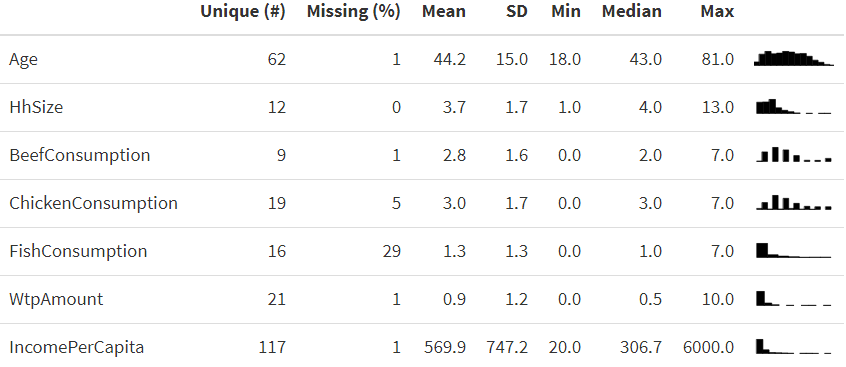
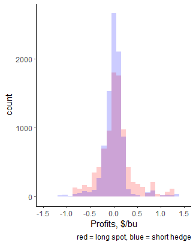
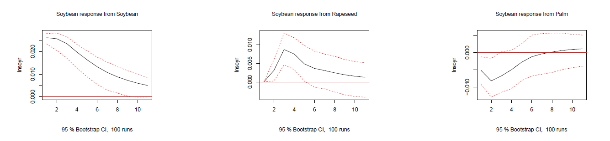
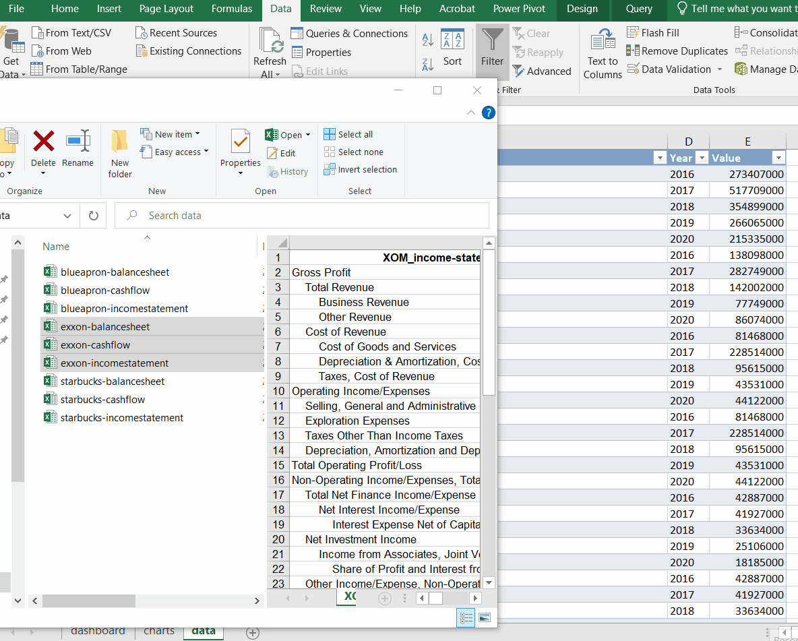
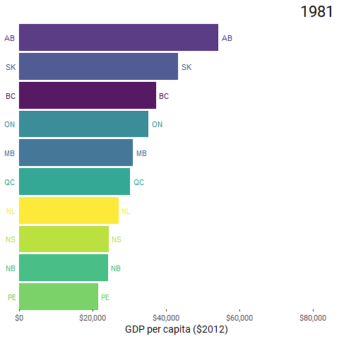
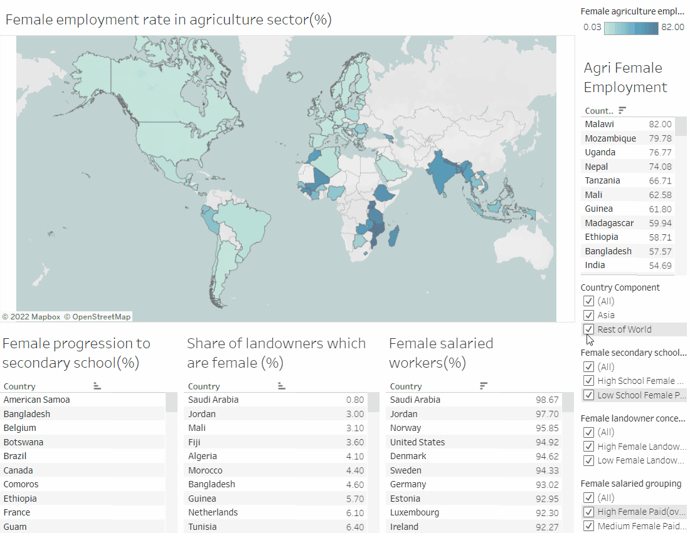
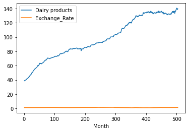
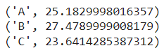
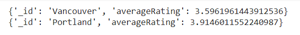

```{css, echo=FALSE}
# CSS for including pauses in printed PDF output (see bottom of lecture)
@media print {
  .has-continuation {
    display: block !important;
  }
}

.remark-slide-scaler {
    overflow-y: auto;
}
```

```{r setup, include=FALSE}
options(htmltools.dir.version = FALSE)
library(knitr)
opts_chunk$set(
  fig.align="center",  
  fig.height=4, #fig.width=6,
  # out.width="748px", #out.length="520.75px",
  dpi=300, #fig.path='Figs/',
  cache=T#, echo=F, warning=F, message=F
  )
library(tidyverse)
library(hrbrthemes)
library(fontawesome)
```

# R for Survey Data Analysis

- Explore summary statistics of key variables 

```{r, eval = F}
beef %>%
    select(Age, HhSize, 
           BeefConsumption, ChickenConsumption, 
           FishConsumption, WtpAmount, 
           IncomePerCapita) %>%
    datasummary_skim()
```

```{r, echo = FALSE, out.width = "60%"}

```

---

# R for Price Analysis

- Comparing hedge and no-hedge profits for a Mid-Iowa cooperative in the corn market

.pull-left[
```{r staticgraph2, eval = F}
# load library
library(ggplot2)

# create overlay histogram of hedge 
# and no hedge profits

ggplot(profits) +
  # long spot profit dist
  geom_histogram(aes(x= long_corn), 
                 fill = "red") +
  # short hedge profit dist
  geom_histogram(aes(x = short_hedge), 
                 fill = "blue") + 
  xlab("Profits, $/bu") + 
  labs(caption = "red = long spot, 
       blue = short hedge")
```
]

.pull-right[
.center[]
]

---
# R for Time Series

- Plot Impulse Response Functions (IRF) to trace impact of shocking one variable on the dynamics of other variables in the system

```{r, eval = F}
# Estimate VAR model
var_veg <- VAR(vegoils_real, p = 3, type = c("const"))

# IRF
plot(irf(model1, impulse = c("lnsoyr"), 
         response = c("lnsoyr", "lnrapeseedr", "lnpalmr"), 
         n.ahead = 10, boot = TRUE, runs = 100, ci = 0.95))
```



---
# Excel and Power Query for Finance

- Updating financial ratio dashboard with new data

```{r, echo = FALSE, out.width = "60%"}

```

---
# R for Data Visualization

- Create an animated graph that shows how GDP/capita changed over time by province

.pull-left[
```{r, eval = F}
# load package
library(gganimate)

# create animated plot
animate(gdp_pc, 
        nframes = 100, 
        fps = 5, 
        end_pause = 20) 
```
]

.pull-right[
.center[]
]

---
# Tableau for Data Visualization

- Presenting analysis of factors affecting female employment rate in agriculture

```{r, echo = FALSE, out.width = "60%"}

```

---

# Python for Data Analysis

- Load in Dairy CPI and plot data to observe trends 

.pull-left[
```{python, eval = F}
import numpy as np
import pandas as pd
import matplotlib.pyplot as plt

#import CPI data
df = pd.read_excel('/Dairy.xlsx', 
index_col='Month', parse_dates=True)
df = df.iloc[:,[1,2]]
df

#plot CPI data
fig, ax = plt.subplots()
df.plot(ax=ax)
plt.show
```
]

.pull-right[
.center[]
]

---

# Python and SQL

- Connect to a relational database and perform basic calculations

```{r, eval = F}
# import library
import psycopg2

# establish a connection
connection = psycopg2.connect(host="mfre.servers.mongodirector.com", 
                              port="5432", user="sgpostgres", 
                              database="postgres", password="1234")

# calculate average food security days by cluster
cursor.execute("""select c.name, avg(cchs.hwtdgbmi)
from clusters c, cchs
where c.adm_rno = cchs.adm_rno
and cchs.hwtdgbmi < 999
group by c.name""")
```

.center[]

---

# Python and MongoDB

- Connect to a non-relational database and compare business ratings

```{r, eval = F}
yvr_pdx = db.businesses.aggregate([
    {'$match': {
      '$or': [
        {'city': 'Vancouver', 
          'state': 'BC'}, 
        {'city': 'Portland',
          'state': 'OR'}]}
    }, {
      '$group': {
      '_id': '$city',
        'averageRating': {
          '$avg': '$stars'}}}])
```

